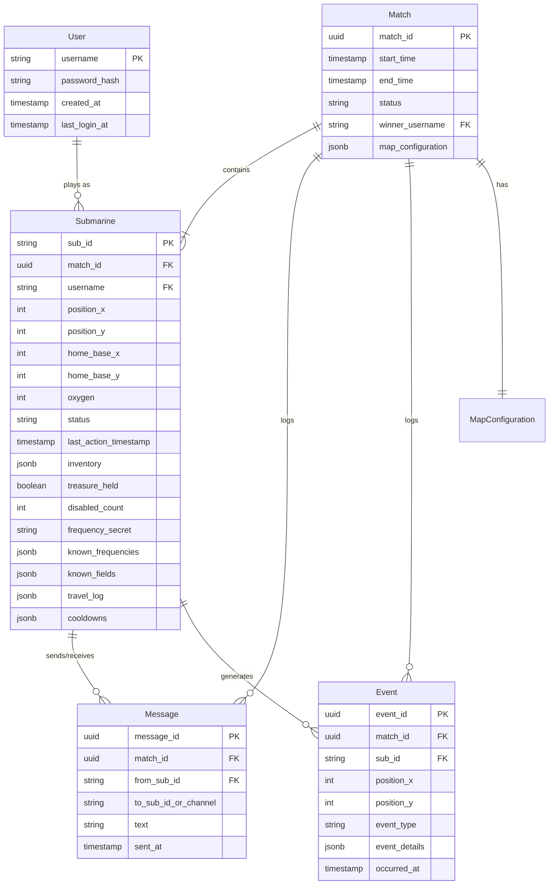
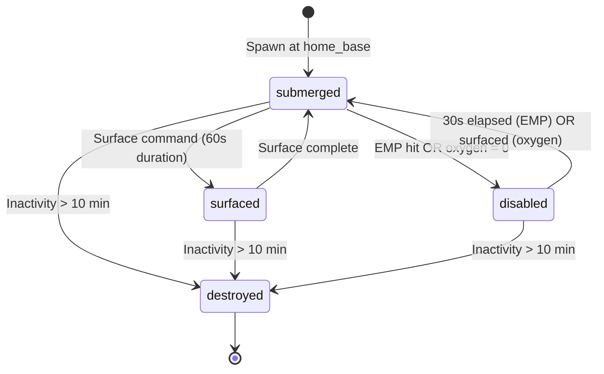
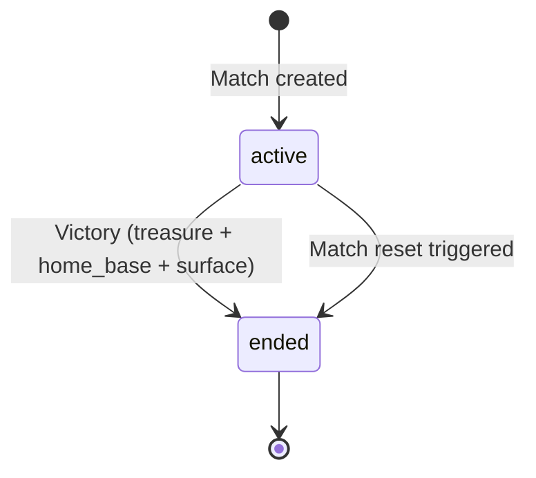

# Data Model: Ras's Deep Treasure Game

**Phase**: 1 (Design & Contracts)
**Date**: 2025-10-24
**Source**: Entities extracted from [spec.md](./spec.md) Key Entities section and Functional Requirements

## Entity Overview



---

## 1. User

**Purpose**: Account for authenticated player access

**Fields**:

| Field | Type | Constraints | Description |
|-------|------|-------------|-------------|
| `username` | `VARCHAR(20)` | PRIMARY KEY, UNIQUE, NOT NULL, 3-20 chars, alphanumeric + underscore | Unique player identifier |
| `password_hash` | `VARCHAR(255)` | NOT NULL | bcrypt hash of password (never store plaintext) |
| `created_at` | `TIMESTAMP` | NOT NULL, DEFAULT NOW() | Account creation timestamp |
| `last_login_at` | `TIMESTAMP` | NULLABLE | Last successful login timestamp |

**Validation Rules** (FR-001, FR-002):
- Username regex: `^[a-zA-Z0-9_]{3,20}$`
- Password minimum 8 characters (validated before hashing)
- `password_hash` generated via bcrypt with work factor 12

**Relationships**:
- One user → many submarines (across different matches)

**Indexes**:
- PRIMARY KEY on `username` (clustered index for lookup)

---

## 2. Match

**Purpose**: Game session tracking for 20-player match lifecycle

**Fields**:

| Field | Type | Constraints | Description |
|-------|------|-------------|-------------|
| `match_id` | `UUID` | PRIMARY KEY | Unique match identifier |
| `start_time` | `TIMESTAMP` | NOT NULL, DEFAULT NOW() | Match start timestamp |
| `end_time` | `TIMESTAMP` | NULLABLE | Match completion timestamp (NULL = active) |
| `status` | `VARCHAR(10)` | NOT NULL, CHECK IN ('active', 'ended') | Match lifecycle state |
| `winner_username` | `VARCHAR(20)` | FOREIGN KEY → User.username, NULLABLE | Winning player (NULL if no winner yet) |
| `map_configuration` | `JSONB` | NOT NULL | Initial map state (treasure location, home bases, tile content) |

**JSON Schema for `map_configuration`**:
```json
{
  "dimensions": { "max_x": 31, "max_y": 31 },
  "treasure_tile": { "x": 15, "y": 20 },
  "home_bases": [
    { "player_index": 1, "x": 0, "y": 0 },
    ...
    { "player_index": 20, "x": 31, "y": 16 }
  ],
  "tiles": [
    { "x": 0, "y": 0, "content": "home_base" },
    { "x": 0, "y": 1, "content": "empty" },
    { "x": 1, "y": 0, "content": "tool", "tool_type": "EMP" },
    { "x": 2, "y": 3, "content": "hazard", "hazard_type": "leak" }
  ]
}
```

**Validation Rules** (FR-007, FR-008, FR-009, FR-022):
- `map_configuration.dimensions` default 32×32 (configurable, minimum 30×30)
- Exactly 1 treasure tile
- Exactly 20 home_base tiles
- ~60% empty, ~10% tool, ~10% hazard distribution

**Relationships**:
- One match → many submarines (max 20)
- One match → many messages
- One match → many events

**Indexes**:
- PRIMARY KEY on `match_id`
- INDEX on `status` (query active matches)

---

## 3. Submarine

**Purpose**: Player's avatar state within a match

**Fields**:

| Field | Type | Constraints | Description |
|-------|------|-------------|-------------|
| `sub_id` | `VARCHAR(30)` | PRIMARY KEY, FORMAT 'sub-{username}' | Unique submarine identifier per match |
| `match_id` | `UUID` | FOREIGN KEY → Match.match_id, NOT NULL | Associated match |
| `username` | `VARCHAR(20)` | FOREIGN KEY → User.username, NOT NULL | Owning player |
| `position_x` | `INT` | NOT NULL, CHECK >= 0 AND <= MAX_X | Current x coordinate |
| `position_y` | `INT` | NOT NULL, CHECK >= 0 AND <= MAX_Y | Current y coordinate |
| `home_base_x` | `INT` | NOT NULL | Spawn and return x coordinate |
| `home_base_y` | `INT` | NOT NULL | Spawn and return y coordinate |
| `oxygen` | `INT` | NOT NULL, CHECK >= 0 AND <= 20, DEFAULT 20 | Current oxygen level |
| `status` | `VARCHAR(10)` | NOT NULL, CHECK IN ('submerged', 'surfaced', 'disabled', 'destroyed') | Submarine state |
| `last_action_timestamp` | `TIMESTAMP` | NOT NULL, DEFAULT NOW() | Last action received (for inactivity timeout) |
| `inventory` | `JSONB` | NOT NULL, DEFAULT '[]' | Array of tool names: `["EMP", "sonar", "repair_kit"]` |
| `treasure_held` | `BOOLEAN` | NOT NULL, DEFAULT FALSE | Whether carrying treasure |
| `disabled_count` | `INT` | NOT NULL, DEFAULT 0 | Cumulative EMP hits (resets on surface) |
| `frequency_secret` | `VARCHAR(36)` | NOT NULL, UNIQUE | UUID assigned at spawn |
| `known_frequencies` | `JSONB` | NOT NULL, DEFAULT '[]' | Array of discovered frequencies: `["freq-abc", "freq-xyz"]` |
| `known_fields` | `JSONB` | NOT NULL, DEFAULT '{}' | Map of discovered tiles: `{"5,7": "empty", "6,7": "tool"}` |
| `travel_log` | `JSONB` | NOT NULL, DEFAULT '[]' | Array of events: `[{"x": 5, "y": 7, "timestamp": "...", "event": "discovered"}]` |
| `cooldowns` | `JSONB` | NOT NULL, DEFAULT '{}' | Map of action → remaining_ms: `{"discover": 8500}` |

**Validation Rules** (FR-013, FR-014, FR-016, FR-022, FR-046):
- `oxygen` range: 0–20; 0 triggers disabled status
- `position` within map bounds (0 ≤ x,y ≤ MAX_X/MAX_Y)
- `last_action_timestamp` > 10 minutes → status becomes 'destroyed'
- `disabled_count` resets to 0 on surface (FR-026)
- `treasure_held` → FALSE if `disabled_count` >= 4 (FR-033)

**Relationships**:
- Many submarines → one match
- One submarine → one user
- One submarine → many messages (sender/receiver)
- One submarine → many events (generator)

**Indexes**:
- PRIMARY KEY on `sub_id`
- INDEX on `(match_id, status)` (query active subs in match)
- INDEX on `(match_id, position_x, position_y)` (collision detection)
- INDEX on `last_action_timestamp` (inactivity timeout queries)

---

## 4. Message

**Purpose**: Inter-submarine communication log

**Fields**:

| Field | Type | Constraints | Description |
|-------|------|-------------|-------------|
| `message_id` | `UUID` | PRIMARY KEY | Unique message identifier |
| `match_id` | `UUID` | FOREIGN KEY → Match.match_id, NOT NULL | Associated match |
| `from_sub_id` | `VARCHAR(30)` | FOREIGN KEY → Submarine.sub_id, NOT NULL | Sender submarine |
| `to_sub_id_or_channel` | `VARCHAR(30)` | NOT NULL | Recipient sub_id or 'ALL' for broadcast |
| `text` | `TEXT` | NOT NULL | Message content |
| `sent_at` | `TIMESTAMP` | NOT NULL, DEFAULT NOW() | Message timestamp |

**Validation Rules** (FR-038, FR-039, FR-040):
- `to_sub_id_or_channel` = 'ALL' for broadcasts or specific sub_id for direct messages
- Direct messages require recipient's frequency in sender's `known_frequencies` (validated at API layer)

**Relationships**:
- Many messages → one match
- Many messages → one submarine (sender)

**Indexes**:
- PRIMARY KEY on `message_id`
- INDEX on `(match_id, to_sub_id_or_channel, sent_at DESC)` (inbox query)

---

## 5. Event

**Purpose**: Travel log and game event audit trail

**Fields**:

| Field | Type | Constraints | Description |
|-------|------|-------------|-------------|
| `event_id` | `UUID` | PRIMARY KEY | Unique event identifier |
| `match_id` | `UUID` | FOREIGN KEY → Match.match_id, NOT NULL | Associated match |
| `sub_id` | `VARCHAR(30)` | FOREIGN KEY → Submarine.sub_id, NOT NULL | Event generator |
| `position_x` | `INT` | NOT NULL | Event x coordinate |
| `position_y` | `INT` | NOT NULL | Event y coordinate |
| `event_type` | `VARCHAR(30)` | NOT NULL | Event category: 'discovered', 'emp_hit', 'surfaced', 'treasure_pickup', 'frequency_exchange', etc. |
| `event_details` | `JSONB` | NOT NULL | Type-specific data: `{"tile_content": "tool", "tool_type": "sonar"}` |
| `occurred_at` | `TIMESTAMP` | NOT NULL, DEFAULT NOW() | Event timestamp |

**Validation Rules** (FR-035, FR-051):
- `event_type` values: `player_spawned`, `tile_discovered`, `treasure_found`, `emp_hit`, `frequency_exchanged`, `player_surfaced`, `player_inactive_timeout`, `match_won`, `match_reset`

**Relationships**:
- Many events → one match
- Many events → one submarine

**Indexes**:
- PRIMARY KEY on `event_id`
- INDEX on `(match_id, sub_id, occurred_at DESC)` (travel log query)
- INDEX on `(match_id, occurred_at DESC)` (match timeline query)

---

## State Transitions

### Submarine Status State Machine



### Match Status State Machine



---

## Cache Schema (Redis)

### Active Submarine State (Hash)

**Key**: `match:{match_id}:sub:{sub_id}`
**Type**: HASH
**Fields**: All submarine fields from database (hot cache)
**TTL**: Match duration + 1 hour

### Match Leaderboard (Sorted Set)

**Key**: `match:{match_id}:leaderboard`
**Type**: ZSET
**Members**: sub_id
**Scores**: Distance to home_base (lower = closer to winning)
**TTL**: Match duration

### WebSocket Pub/Sub Channels

**Channel**: `match:{match_id}:events`
**Messages**: JSON payloads for treasure_discovered, emp_hit, player_surfaced, match_won

---

## Migration Notes

1. **Initial Schema**: Create tables in order: User → Match → Submarine → Message → Event
2. **Indexes**: Create after bulk data load (faster than incremental index updates)
3. **Constraints**: Add foreign keys last to avoid circular dependency issues
4. **JSONB Optimization**: Use GIN indexes on `known_fields`, `travel_log` if querying nested keys (e.g., `known_fields @> '{"5,7": "empty"}'`)

---

## Next Steps

Proceed to `contracts/openapi.yaml` generation for REST API endpoint definitions.
